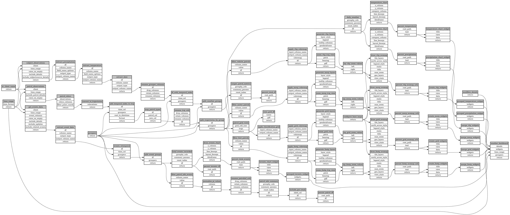

```
# AUTOGENERATED BY ECOSCOPE-WORKFLOWS; see fingerprint in README.md for details

```

```yaml
# fingerprint:
artifacts_sha256_basic: d7c7a73311a86c089768d7e2d15b860ab84e1da210f91fa28b5d922f296a7689
artifacts_sha256_strict: 5e496a76ea4c87f0dbdf47da8acfb40927460063c44678ab3c346509cbe61613
installed_requirements:
- channel: https://repo.prefix.dev/ecoscope-workflows/
  name: ecoscope-workflows-core
  version: {version: ==0.13.0}
- channel: https://repo.prefix.dev/ecoscope-workflows-custom/
  name: ecoscope-workflows-ext-custom
  version: {version: ==0.0.5}
- channel: file:///tmp/ecoscope-workflows-custom/release/artifacts/
  name: ecoscope-workflows-ext-mnc
  version: {version: ==10000.dev4+gbb6eaa30e.d20251022}
params_sha256: 1ee45f69652d4d21f636dc913039adb8061b617cfe92ddc9697a076727d396c0
spec_sha256: 23ad4d3d9a3a4270617f476236713e5c837fb4c880db0367b2c0e3b2a8473c6c

```

# ecoscope-workflows-customized-report-workflow


