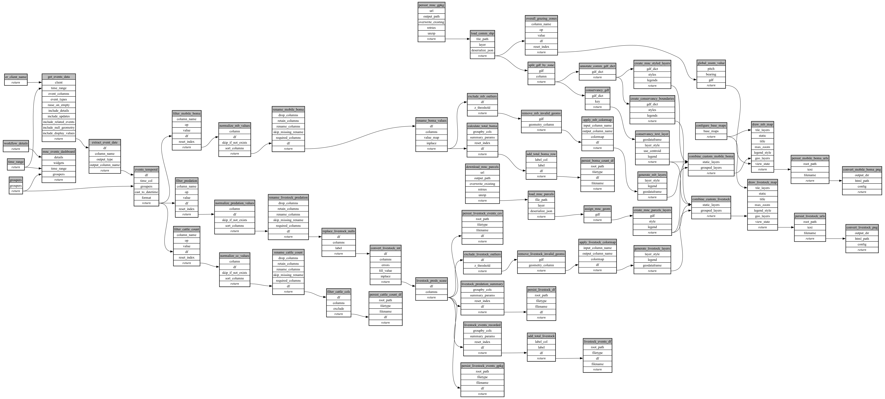

```
# AUTOGENERATED BY ECOSCOPE-WORKFLOWS; see fingerprint in README.md for details

```

```yaml
# fingerprint:
artifacts_sha256_basic: 397b5fe9ea8586958de749781832b2846345dd664c82fc982debc57efe6b4f48
artifacts_sha256_strict: 0bdc856c5d4f1add3ece062f110e910bf0695e39f67c71bd2151c13e49ce26e2
installed_requirements:
- channel: https://repo.prefix.dev/ecoscope-workflows/
  name: ecoscope-workflows-core
  version: {version: ==0.22.18}
- channel: https://repo.prefix.dev/ecoscope-workflows/
  name: ecoscope-workflows-ext-ecoscope
  version: {version: ==0.22.18}
- channel: https://repo.prefix.dev/ecoscope-workflows-custom/
  name: ecoscope-workflows-ext-custom
  version: {version: ==0.0.39}
- channel: https://repo.prefix.dev/ecoscope-workflows-custom/
  name: ecoscope-workflows-ext-ste
  version: {version: ==0.0.13}
- channel: https://repo.prefix.dev/ecoscope-workflows-custom/
  name: ecoscope-workflows-ext-mnc
  version: {version: ==0.0.8}
params_sha256: 3ab4c0f59c459fe3feea277da14ef6a8b3d0dfc0f958f3f015ddd4d700bcc5f8
spec_sha256: 99cf5698113556515082753763b9d5089a30804bc3ed190f843b5a98938724a6

```

# ecoscope-workflows-livestock-monitoring-workflow


