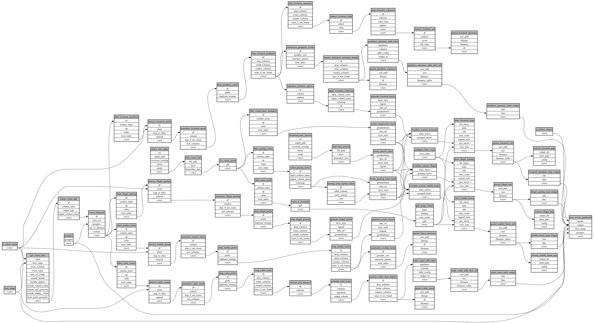

```
# AUTOGENERATED BY ECOSCOPE-WORKFLOWS; see fingerprint in README.md for details

```

```yaml
# fingerprint:
artifacts_sha256_basic: cd466098d9f744aac4ace8c79c7e716a19f1616fb4aa7c944a86510337972555
artifacts_sha256_strict: 29c95c5b2eb429681daa666524a1df385917a1112042e505450ce68465578db1
installed_requirements:
- channel: https://repo.prefix.dev/ecoscope-workflows/
  name: ecoscope-platform
  version: {version: ==2.15.1}
- channel: https://repo.prefix.dev/ecoscope-workflows-custom/
  name: ecoscope-workflows-ext-custom
  version: {version: ==0.1.0rc14}
- channel: https://repo.prefix.dev/ecoscope-workflows-custom/
  name: ecoscope-workflows-ext-ste
  version: {version: ==0.0.0rc1}
- channel: file:///tmp/ecoscope-workflows-custom/release/artifacts/
  name: ecoscope-workflows-ext-mnc
  version: {version: ==0.0.12.dev0+g44f61a3bc.d20260807}
- channel: conda-forge
  name: pydeck
  version: {version: ==0.9.2}
- channel: conda-forge
  name: opentelemetry-sdk
  version: {version: ==1.44.0}
params_sha256: 8ec66f689124f09fdc0b9e58fd0668d6d6a9a023df19834cdf059202d17289b4
spec_sha256: 804a83640d963f9b750a7a1eb65756bbb75ba46f7eb9e9855bbe14480e72d6ff

```

# ecoscope-workflows-livestock-monitoring-workflow


