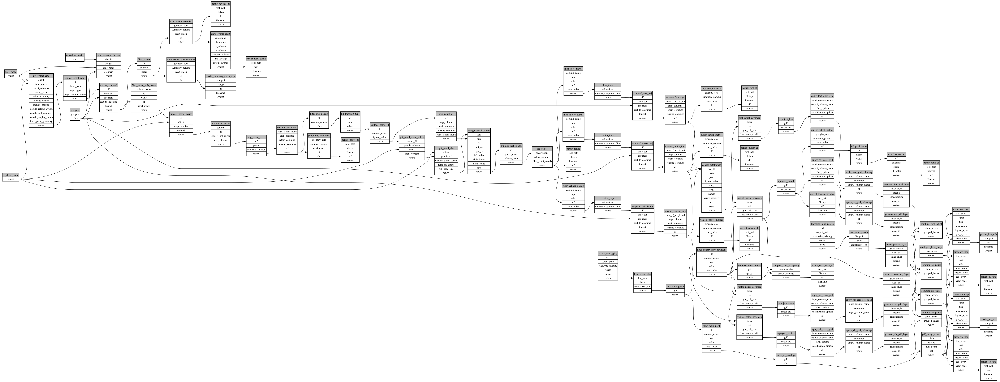

```
# AUTOGENERATED BY ECOSCOPE-WORKFLOWS; see fingerprint in README.md for details

```

```yaml
# fingerprint:
artifacts_sha256_basic: 239fa433df5f986404a71b5eae59ac98af0750b65b183aee2577dc26e48ea1db
artifacts_sha256_strict: 08285ad130d0f7120e5a13c63e4119a57f01a2693e43ef0fa5a3bc0b21930829
installed_requirements:
- channel: https://repo.prefix.dev/ecoscope-workflows/
  name: ecoscope-platform
  version: {version: ==2.15.1}
- channel: https://repo.prefix.dev/ecoscope-workflows-custom/
  name: ecoscope-workflows-ext-custom
  version: {version: ==0.1.0rc14}
- channel: https://repo.prefix.dev/ecoscope-workflows-custom/
  name: ecoscope-workflows-ext-ste
  version: {version: ==0.0.0rc1}
- channel: https://repo.prefix.dev/ecoscope-workflows-custom/
  name: ecoscope-workflows-ext-wwf-virunga
  version: {version: ==0.0.0rc9}
- channel: https://repo.prefix.dev/ecoscope-workflows-custom/
  name: ecoscope-workflows-ext-big-life
  version: {version: ==1.0.1}
- channel: file:///tmp/ecoscope-workflows-custom/release/artifacts/
  name: ecoscope-workflows-ext-mnc
  version: {version: ==1.0.2.dev0+g337811f42.d20260821}
- channel: conda-forge
  name: pydeck
  version: {version: ==0.9.2}
- channel: conda-forge
  name: opentelemetry-sdk
  version: {version: ==1.44.0}
params_sha256: 8ec66f689124f09fdc0b9e58fd0668d6d6a9a023df19834cdf059202d17289b4
spec_sha256: 89ee0ab7a8b8c6a1da39c160124699953c95a52570946aad6ee9799b9171bffb

```

# ecoscope-workflows-patrol-effort-report-workflow


