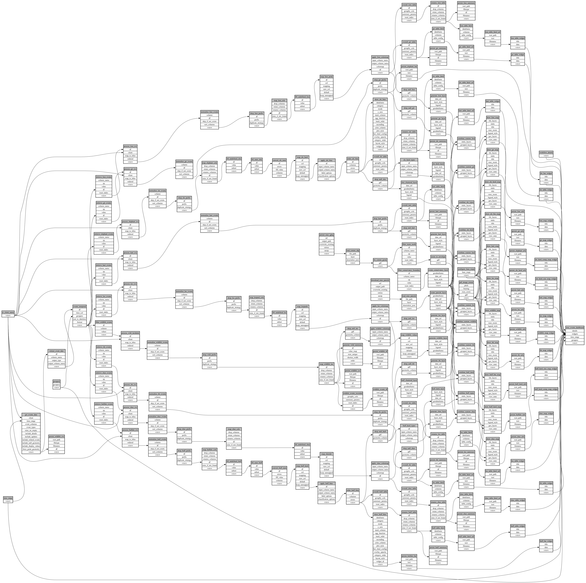

```
# AUTOGENERATED BY ECOSCOPE-WORKFLOWS; see fingerprint in README.md for details

```

```yaml
# fingerprint:
artifacts_sha256_basic: c8f4bed69c9476331a26597c8b045aaba39f4f9dbd17d5c5408ded655a1f61fa
artifacts_sha256_strict: 335b23a4bd14eaa9f48029045205168b8754bc50d6055706bda9c1c8ddc41dad
installed_requirements:
- channel: https://repo.prefix.dev/ecoscope-workflows/
  name: ecoscope-platform
  version: {version: ==2.15.1}
- channel: https://repo.prefix.dev/ecoscope-workflows-custom/
  name: ecoscope-workflows-ext-custom
  version: {version: ==0.1.0rc14}
- channel: https://repo.prefix.dev/ecoscope-workflows-custom/
  name: ecoscope-workflows-ext-ste
  version: {version: ==0.0.0rc1}
- channel: https://repo.prefix.dev/ecoscope-workflows-custom/
  name: ecoscope-workflows-ext-wwf-virunga
  version: {version: ==0.0.0rc9}
- channel: https://repo.prefix.dev/ecoscope-workflows-custom/
  name: ecoscope-workflows-ext-big-life
  version: {version: ==1.0.1}
- channel: file:///tmp/ecoscope-workflows-custom/release/artifacts/
  name: ecoscope-workflows-ext-mnc
  version: {version: ==1.0.1.dev1+g2edd0ef41}
- channel: conda-forge
  name: pydeck
  version: {version: ==0.9.2}
- channel: conda-forge
  name: opentelemetry-sdk
  version: {version: ==1.44.0}
params_sha256: 8ec66f689124f09fdc0b9e58fd0668d6d6a9a023df19834cdf059202d17289b4
spec_sha256: 1bd8f8e2d1c2f18647cf6333990d30a27c60e8757a87fa13eabd44f373cead55

```

# ecoscope-workflows-wildlife-monitoring-report-workflow


